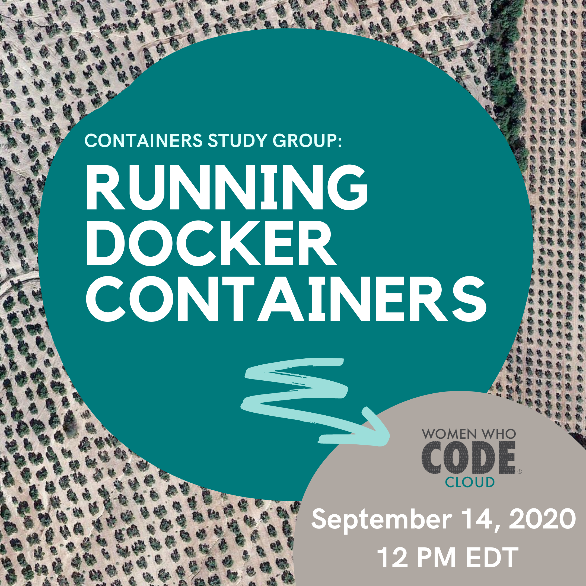
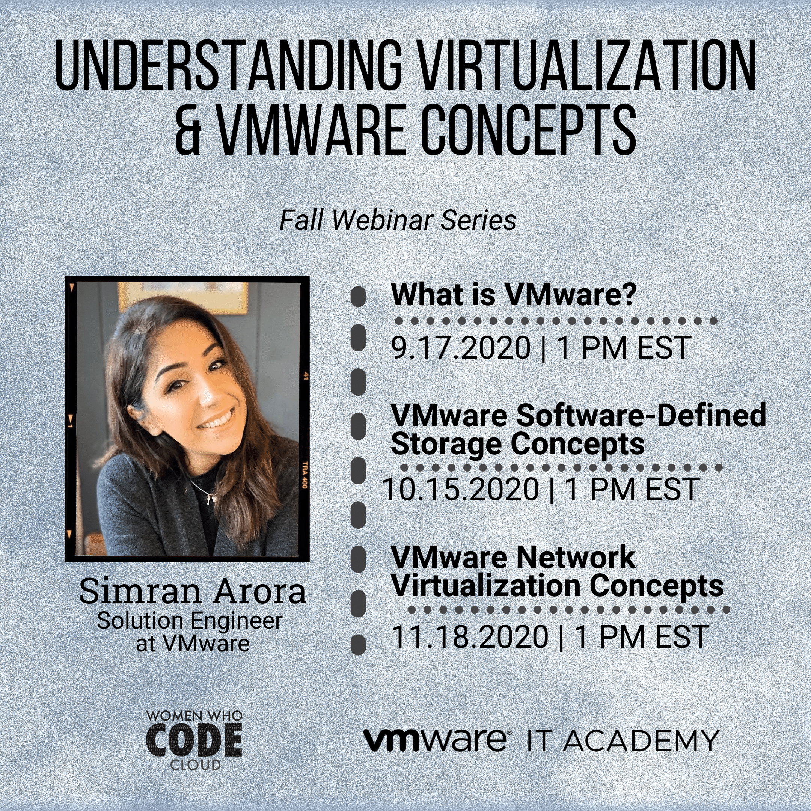
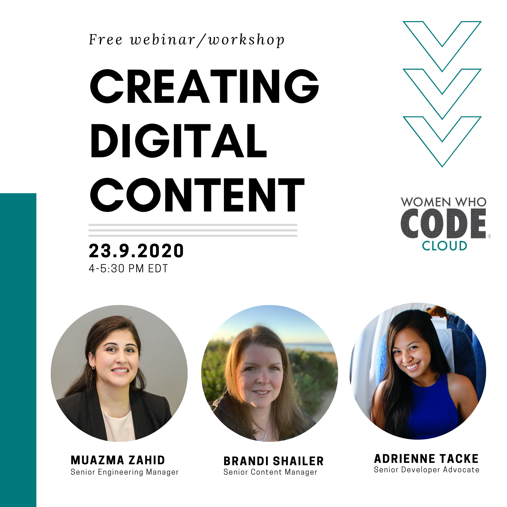

  &nbsp;&nbsp;&nbsp; 

Welcome! This repo contains content, code & resources for the Women Who Code Cloud Track Events.

The Cloud technical track of Women Who Code is a community dedicated to inspiring women to excel in their technology careers as cloud and backend software engineers. We bring together women from all over the world for online learning opportunities. Our free monthly webinars cover various topics around software engineering and the cloud.

💻 Technical Webinars 📲 Coding Resources 💭 Study Group Sessions 🗺️ Supportive Global Network

**If you're interested in joining the community as a member or volunteer please visit our [website](https://www.womenwhocode.com/cloud) for more information! Or send us an [email](cloud@womenwhocode.com).**

## Social

Join our community conversations!

[Slack](https://join.slack.com/t/wwcodecloud/shared_invite/zt-fsr8x4av-mmSMyzczGiKjBdKAODs0Dg)  
[Twitter](https://twitter.com/wwcodecloud)  
[Instagram](https://www.instagram.com/wwcodecloud/)  
[Facebook](https://www.facebook.com/Women-Who-Code-Cloud-147081753767317)  

## Event Resources

Expand the section below to find all the resources shared during past and upcoming events. Clicking on a logo will take you to the event code base or slides. You will also find a link to the video recording in the event description. All of our events are uploaded to the [Women Who Code Youtube Channel](https://www.youtube.com/channel/UCfMEaBUSABoOsxr7HgSmEdA) 1-3 days following an event. Please reach out with any questions or issues, or join us in our Slack channel for interactive discussions and support.

To add new resources for events follow the [CONTRIBUTING guidelines](CONTRIBUTING.md).

#### Recent events:

| | |
| ----------- | ----------- |
| | **Microservices and the 12-factor app**    This webinar walks us through the history of software architectural design and takes a look at the components of a 12-factor application and why they work so well in a highly distributed Cloud environment?    [Slides](events/Microservices101.pdf)    -Jennifer Bergstrom, _Cloud Services Team Lead_ |
| | **Discover Chaos Engineering**    As systems become very larger, more distributed, and more complex, effectively testing those systems becomes ever more challenging. Building a test environment that is similar to the production environment is simply not possible in widely distributed systems like those hosted in public cloud environments. So how can we prove that our systems are capable, resilient and fault-tolerant? Through the use of Chaos Engineering! This webinar walks us through the history, benefits, strategies for implementation of, tools and best practices for Chaos Engineering.    [Slides](events/ChaosEngineering.pdf)    -Jennifer Bergstrom, _Cloud Services Team Lead_ |
|  | **Building production ready images with Docker**    Mariia and Lorna will present on building multi-stage images. We will cover the history of building images, talk about "Builder pattern" and analyze examples of Dockerfiles for multi-stage images for application written in Go, Elixir and JS.    [Slides](https://docs.google.com/presentation/d/1COD-DbqSVVvRC4M_hTk16gbWjD_ujElswOH8KhP3oNE/edit#slide=id.g81d8810817_0_160)    [Video Recording](https://www.youtube.com/watch?v=uVPvq2DV1CY&t=4s)   -Mariia Kerimova _DevOps Engineer_, -Lorna Tumuhairwe _SRE_ |
|  | **Understanding VMware Cloud and Virtualization Concepts**    Let's explore creating a virtual machine and the benefits and move from a physical environment to a virtual one! We will talk about types of virtualization used for data centers, and describe the concepts of server, network, storage, and desktop virtualization. Define what is virtualization, virtual machines, hypervisors, and VMware vSphere® components. Moreover, we will analyze how individuals and businesses benefit from virtualization, understand cloud concepts such as types of cloud computing and popular cloud deployment models.    [Slides](https://docs.google.com/presentation/d/1I-akLlta3sZbY7zlGSPYB7sOd9uVc1Bhjn1w7FIXRgU/edit?usp=sharing)    [Video Recording]()    -Simran Arora, _Solution Engineer at VMware_ |
|  | **Creating Digital Learning Content**    In this session, we will learn about the benefits of creating online learning content. Hear from Senior Developer Advocate Adrienne Tacke and Linkedin Learning Coordinator Brandi Shalier about how to become an digital instructor and how online instructing can build your confidence, your presence, and a secondary income stream.     [Register](https://us02web.zoom.us/webinar/register/WN_cY3yRsYeQQKXUfzD_imoFw)    -Adrienne Braganza Tacke, _Senior Developer Advocate at MongoDB_ -Brandi Shailer, _Senior Content Manager at LinkedIn_, -Muazma Zahid, _Senior Engineering Manager at Microsoft Azure_ |
|  | **The Journey To AWS Pro -A Cloud Certification Study Group**    This study group will have 4 phases with a series of sessions preparing participants to reach the AWS Pro Certification. Members will walk through guided exam material overviews, hands on labs , practices tests and lots of discussion points. This journey will not only help prepare you to pass the exam, but we will also build on our community experience to apply our learnings to real world projects.    [Register](https://us02web.zoom.us/webinar/register/WN_p9FbnOp-Qjq2oB3bLgEewA)     -Bri Augenreich, _Leadership Fellow @Women Who Code_ |

➡️ Click to see <a href="previous_events.md">more events</a>! 👀

## About Women Who Code

WWCode is the largest and most active community of technical women in the world. We have over 230,000 members in 70 cities spanning 97 countries & counting. Join our community by visiting [womenwhocode.com](womenwhocode.com) and sign up to become a member.

## Code of Conduct

Women Who Code (WWCode) is dedicated to providing an empowering experience for everyone who participates in or supports our community. Our events are intended to inspire women to excel in technology careers, and anyone who is there for this purpose is welcome. Because we value the safety and security of our members and strive to have an inclusive community, we do not tolerate harassment of members or event participants in any form. This Code of Conduct was created to clearly define what we mean by a harassment-free experience, so that our community and those who support it are clear about our intent and have access to procedures for addressing issues, should they arise.
[Code of Conduct](https://www.womenwhocode.com/codeofconduct)

## Contributing

We welcome your contributions! :two_hearts: To contribute to this repo, follow the setup instructions below

1. 🍴 Fork this repo  
2. 🔨 Follow the [contributing guidelines](CONTRIBUTING.md)
3. 👥 Add yourself as a contributor under the credits section
4. 🔧 Make a pull request
5. 🎉 Get your pull request approved - success!

Or just [create an issue](https://github.com/womenwhocode/wwcodecloud/issues) - any little bit of help counts! 😊

## Credits

Thank you to our lovely [contributors](https://github.com/womenwhocode/wwcodecloud/graphs/contributors).

 

  &nbsp;&nbsp;&nbsp; 
