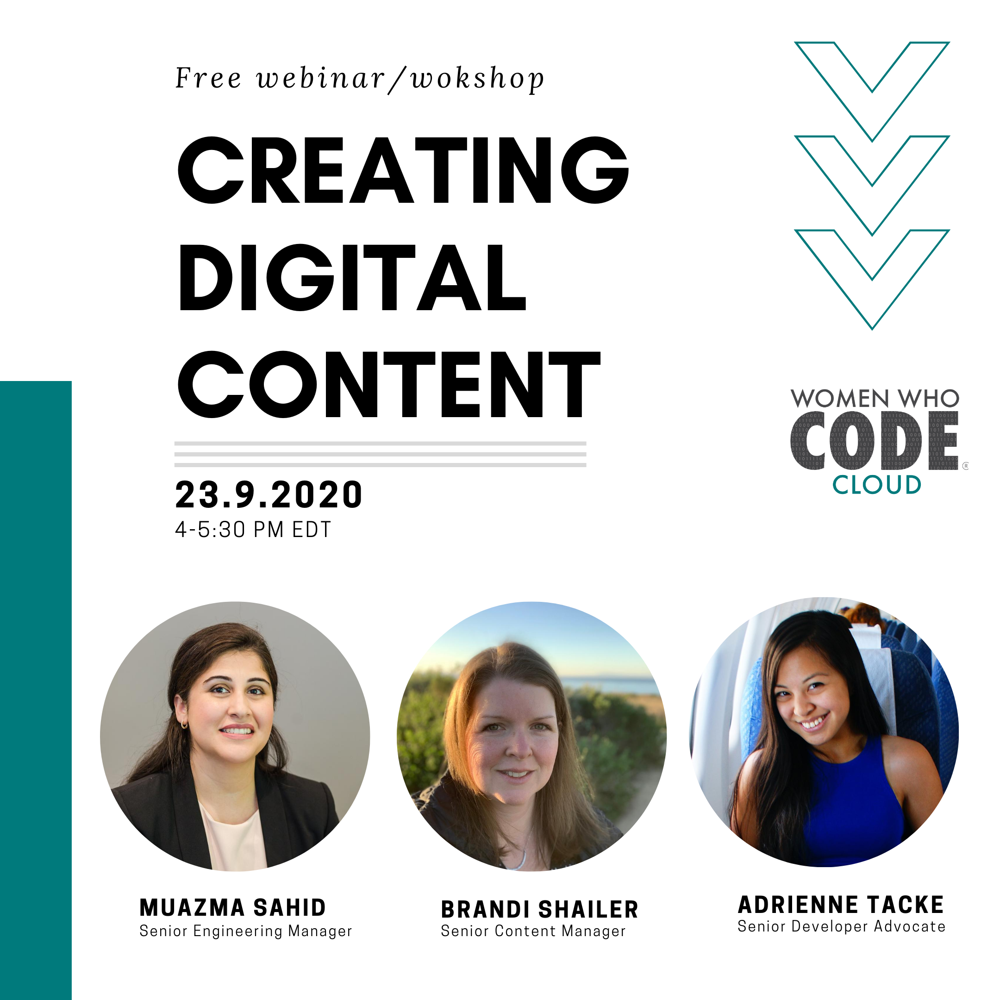
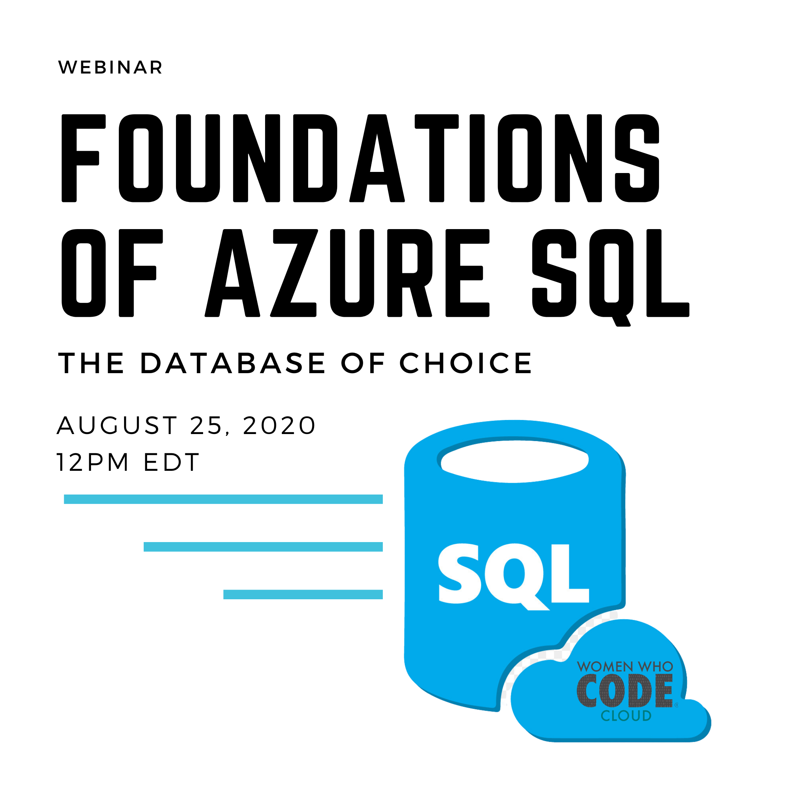
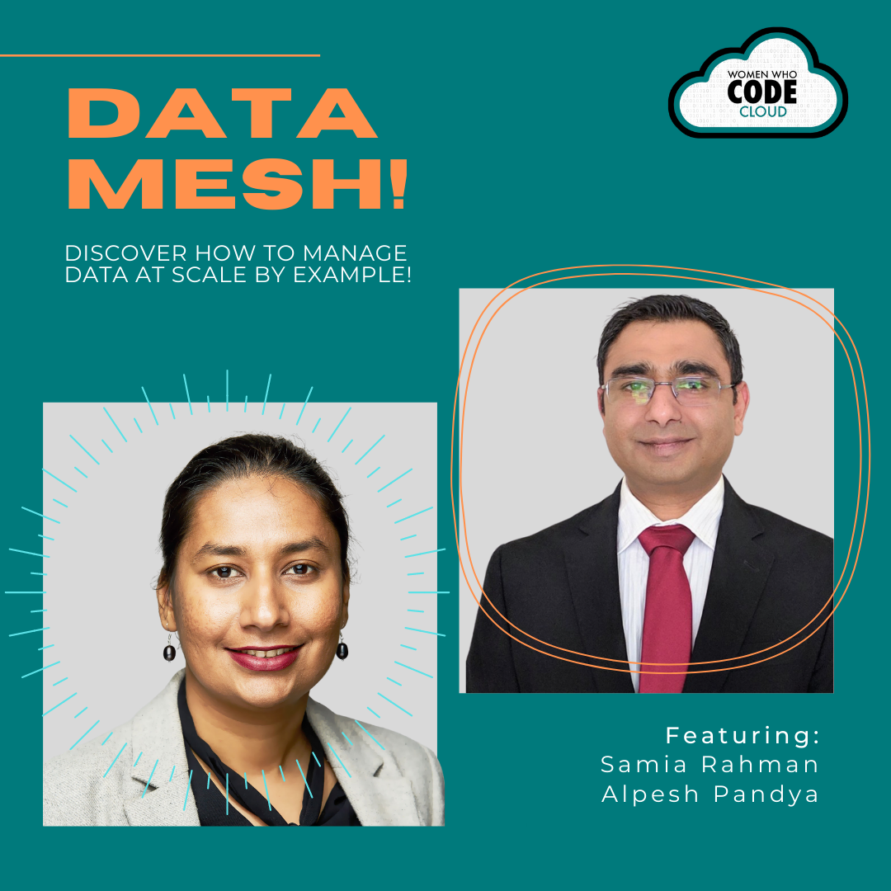
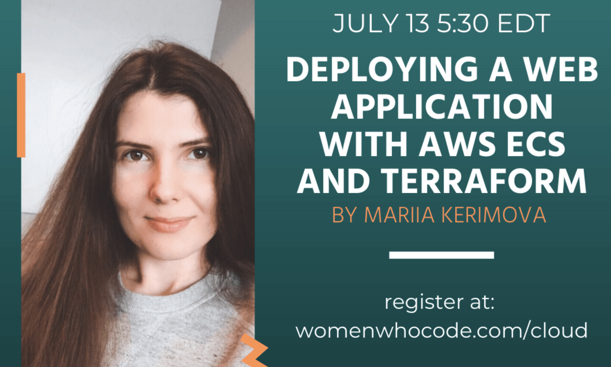

### Previous events and recordings: 

| | |
| ----------- | ----------- |
| | **Kafka 101 and Event Driven Architecture**    Join Women Who Code and our speaker Amanda Gilbert from Confluent, for a technical overview and introduction to Kafka, and real world applications of Event Driven Architecture.    [Slides](events/Amanda_Gilbert_Kafka_101.pdf)    [Video Recording](https://www.youtube.com/watch?v=5SnnUjykWdI)   -Amanda Gilbert |
|  | **The Journey To AWS Pro -A Cloud Certification Study Group**    This study group will have 4 phases with a series of sessions preparing participants to reach the AWS Pro Certification. Members will walk through guided exam material overviews, hands on labs , practices tests and lots of discussion points. This journey will not only help prepare you to pass the exam, but we will also build on our community experience to apply our learnings to real world projects.    [Video Recording](https://www.youtube.com/watch?v=8zUb7eq6dWk)   -Bri Augenreich, _Master Software Engineer_ |
|  | **Creating Digital Learning Content**    In this session, we will learn about the benefits of creating online learning content. Hear from Senior Developer Advocate Adrienne Tacke and Linkedin Learning Coordinator Brandi Shalier about how to become an digital instructor and how online instructing can build your confidence, your presence, and a secondary income stream.    [Register](https://us02web.zoom.us/webinar/register/WN_cY3yRsYeQQKXUfzD_imoFw)    -Adrienne Braganza Tacke and Brandi Shailer, Host: Muazma Zahid |
|  | **Foundations of the Azure SQL Database, the Database of Choice**    This session will cover the foundation of the Azure SQL Database service (the most matured PaaS offering on Azure), and showcase through multiple demos, why it is a database of choice for a variety of applications. Participants will see various modern application use cases and customer examples to further drive home their learnings.    [Register](https://us02web.zoom.us/webinar/register/WN_UFnhgqkCRZygCD_3hZ9X2A)    -Sanjay Mishra, _Microsoft_ |
|  | **Data Mesh - Data Product Application by Example**    Traditional data lake architectures tend to fail at scale. Data mesh is a new approach to handling large amounts of data at scale within an organization. This session focuses on the application code of a data product that ingests data via its input port, processes it and produces output at its output port.    [Video Recording](https://www.youtube.com/watch?v=uwuGPrxeZ2w)   -Samia Rahman and Alpesh Pandya, _Thoughtworks_ |
|  | **AWS+Terraform + Docker +ECS**    In this workshop we will discuss how to provision infrastructure using Terraform and how AWS Elastic Container Service (ECS) enables deployments of application docker containers. Participants will walk through a hands-on example deploying a web application.   Bonus: We will see how GitHub Actions can enable automated delivery!    [Video Recording](https://www.youtube.com/watch?v=Ky7sph6fBtM&t=212s)   -Mariia Kerimova, _DevOps Engineer_ |
|  | **AWS Certification Panel or FireSide Chat**    Are you thinking about or currently pursing an AWS certification? Join us for a fireside chat with experienced cloud certified engineers Mary Kate Comer and Tiffany Jachja. During the session attendees will learn from our speakers experiences and get a chance to ask the speakers their questions about AWS certification.    [Video Recording](https://www.youtube.com/watch?v=-KZjwdEML3k)   -Mary Kate Comer and Tiffany Jachja |
